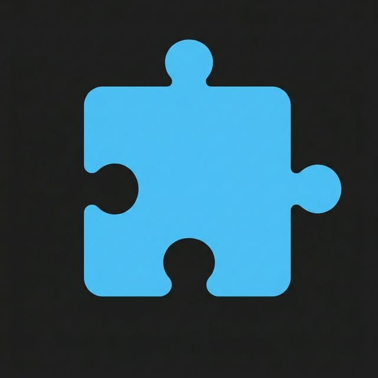

#  Jigsaw Qt - Casual Puzzle Game

Jigsaw Qt is a simple, window-responsive jigsaw puzzle application built with **Python 3** and **PySide6**. It provides a clean, easy-to-play gaming experience for casual puzzle lovers on the Linux desktop.

## ✨ Features

- **Pixel-Perfect Rendering**: Advanced `CompositionMode_DestinationIn` masking ensures pieces are cut with mathematical precision and 100% transparency on curvy edges.
- **Dynamic Window Scaling**: The game board and pieces automatically scale to occupy 80% of your window area, ensuring a crisp look on any monitor.
- **Independent Interaction Model**:
  - **Left Click**: Dedicated piece dragging with Z-order priority.
  - **Mouse Wheel**: Natural horizontal scrolling for the bottom piece tray.
- **Smart Snapping**: Pieces snap to their correct board positions and neighboring pieces with customizable thresholds.
- **Cluster Merging**: Moving one piece automatically moves all connected (snapped) pieces as a single cluster.
- **Hint Overlay**: Toggle a faint reference image under the board to guide your build.
- **Edge Piece Filter**: Quickly focus on the border by hiding inner pieces in the tray.
- **Shuffle Tray**: Reshuffle pieces in the tray to find the right fit.
- **Completion Tracking**: Real-time progress bar shows how close you are to finishing.
- **Visual Feedback**: Satisfying pulse glow effect when a piece snaps into place.
- **Premium Aesthetics**: Deep dark mode theme with glassmorphism-inspired button states and smooth animations.

## ⌨️ Shortcuts

- **H**: Toggle Hint Overlay
- **E**: Toggle Edge Piece Filter
- **S**: Shuffle Tray
- **Space (Hold)**: View full reference image (Guide)
- **F12**: Toggle Debug Mode (Developer only)

## 🚀 Getting Started

### Prerequisites

- Python 3.10 or higher
- PySide6

### Installation

```bash
pip install PySide6
```

### Running the Game

```bash
python main.py
```

## 🛠 Project Structure

- `main.py`: Application entry point and UI layout.
- `board.py`: Core game engine and geometry logic.
- `piece.py`: Individual jigsaw piece representation.
- `config.py`: Centralized configuration and styling constants.

## 📦 Distribution (Flatpak)

This project is prepared for [Flathub](https://flathub.org).
Metadata files (`.desktop`, `.metainfo.xml`, `manifest.yml`) are included in the repository.

## 📄 License

MIT License. See [LICENSE](LICENSE) for details.
